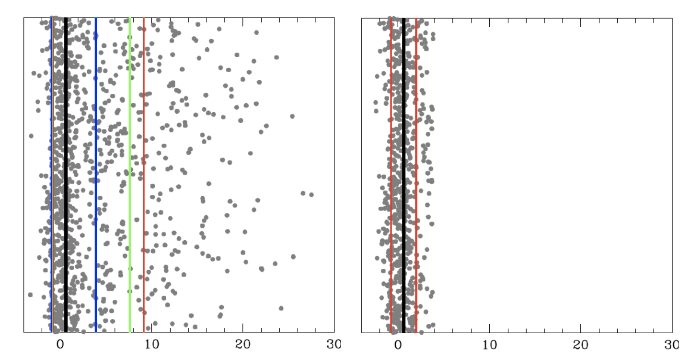

# Robust Chauvenet Outlier Rejection (RCR)

      

*Left: data distribution heavily saturated with one-sided outliers/contaminants, with true value in black. Right: remaining un-contaminated distribution after single-value RCR outlier removal.*

# What is RCR?
RCR is advanced, but easy to use, outlier rejection.

The simplest form of outlier rejection is sigma clipping, where measurements that are more than a specified number of standard deviations from the mean are rejected from the sample. This number of standard deviations should not be chosen arbitrarily, but is a function of your sample’s size. A simple prescription for this was introduced by William Chauvenet in 1863. Sigma clipping plus this prescription, applied iteratively, is what we call traditional Chauvenet rejection.

However, both sigma clipping and traditional Chauvenet rejection make use of non-robust quantities: the mean and the standard deviation are both sensitive to the very outliers that they are being used to reject. This limits such techniques to samples with small contaminants or small contamination fractions.

Robust Chauvenet Rejection (RCR) instead first makes use of robust replacements for the mean, such as the median and the half-sample mode, and similar robust replacements that we have developed for the standard deviation.

RCR has been carefully calibrated, and extensively simulated (see [Maples et al. 2018](https://arxiv.org/abs/1807.05276)). It can be applied to samples with both large contaminants and large contaminant fractions (sometimes in excess of 90% contaminated).

*Left: Data distribution about true quadratic model (black), heavily saturated with one-sided outliers/contaminants. Right: remaining distribution after functional RCR outlier removal.*

# Installation and Documentation
RCR can be used most easily via Python, installed using `pip install rcr`. The Python documentation can be found [here](rcr.readthedocs.io).

The C++ source code is also included here in `/source`, with pdf documentation in `/documentation`.

# How do I use RCR?
We have boiled it down to two simple user choices:

**1.** Are your uncontaminated measurements distributed symmetrically, like a Gaussian (or mildy peaked or flat-topped), mildly asymmetrically, or neither?

**2.** Are the contaminants to your measurements high and low in equal proportions, all high or all low, or something in between?

RCR can be applied to weighted data, to functional data (e.g., x vs. y), and we have incorporated bulk rejection to decrease computation times with large samples.

We also offer easy-to-use online calculators for [single value](https://skynet.unc.edu/rcr/calculator/value) and [functional](https://skynet.unc.edu/rcr/calculator/functional) (model-fitting) RCR. The source code, however, is equipped with the maximum degree of customizability for using RCR, most notably with the functional form/model-fitting portion of the algorithm. In addition to the features offered by the online calculator, the full functional RCR source code also includes support for:

**1.** Running RCR on any custom model function with any number of independent ("x") variables and model function parameters;

**2.** Custom prior distribution functions for any or all of the model function parameters;

**3.** Support for model functions with custom "pivot point" variables that control correlation between model parameters, e.g. x0 for the linear model y(x)=b+m(x-x0);

and more.

# Licensing and Citation

RCR is free to use for academic and non-commercial applications (see license in this repository). We only ask that you cite [Maples et al. 2018](https://arxiv.org/abs/1807.05276).

For commercial applications, or consultation, feel free to contact us.

There is no more fundamental act in science than measurement. There is no more fundamental problem in science than contaminated measurements. RCR is not a complete solution...but it is very close! We hope that you enjoy it.

Dan Reichart, Michael Maples, Nick Konz

Department of Physics and Astronomy

University of North Carolina at Chapel Hill
